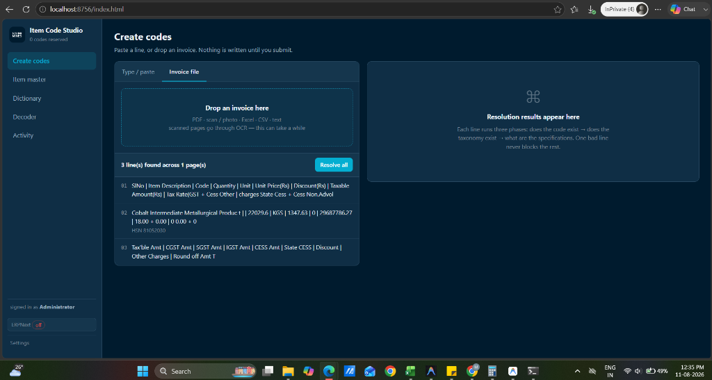
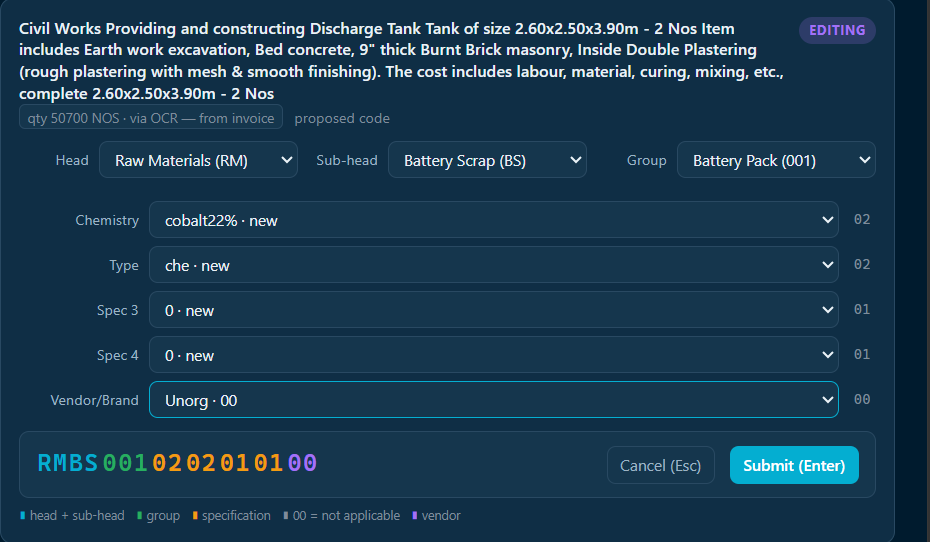
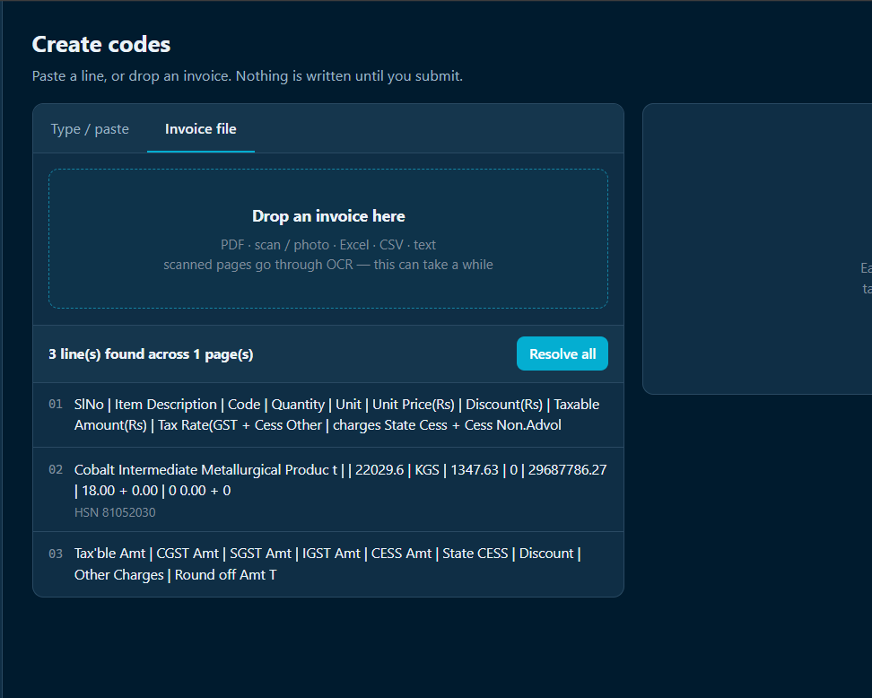
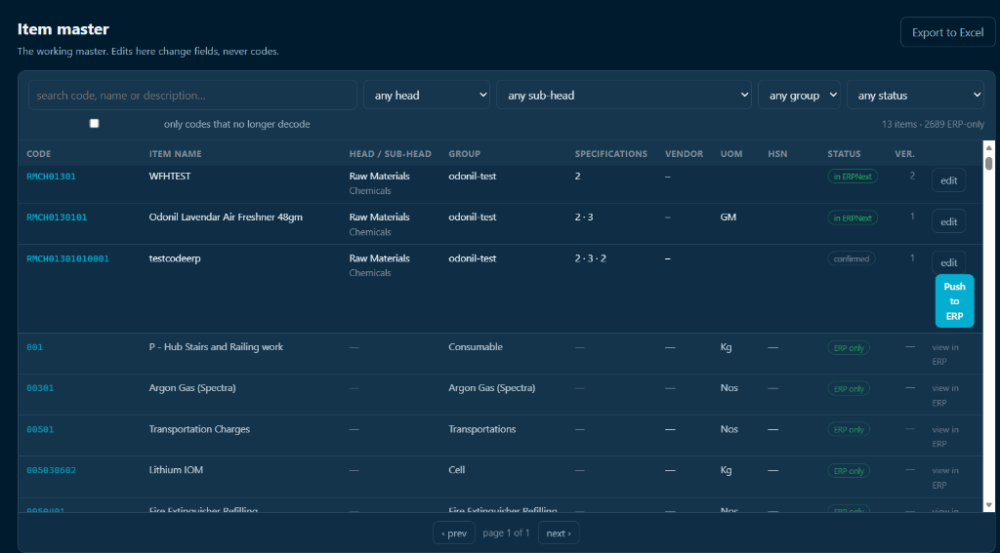
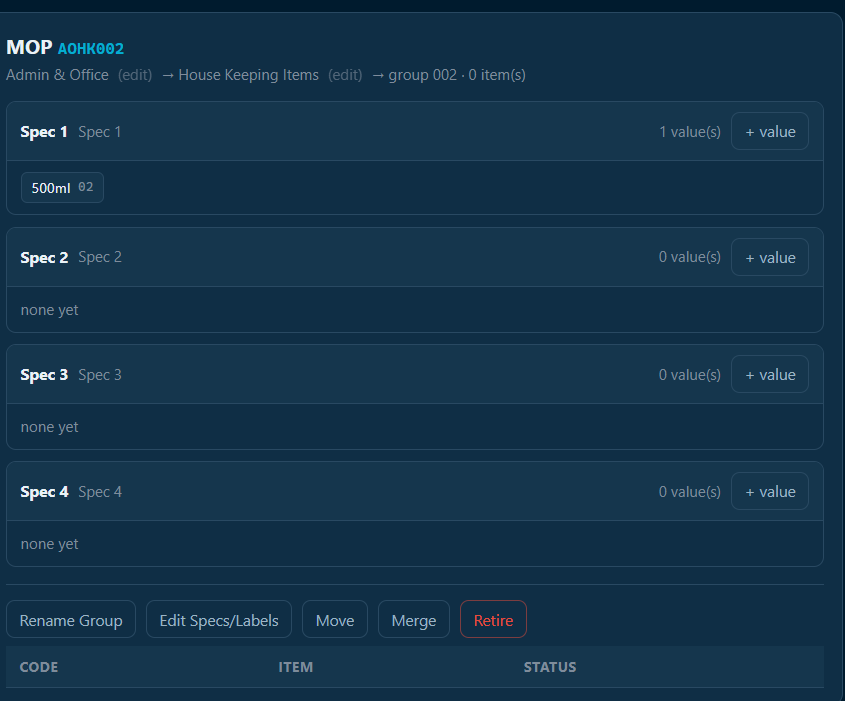
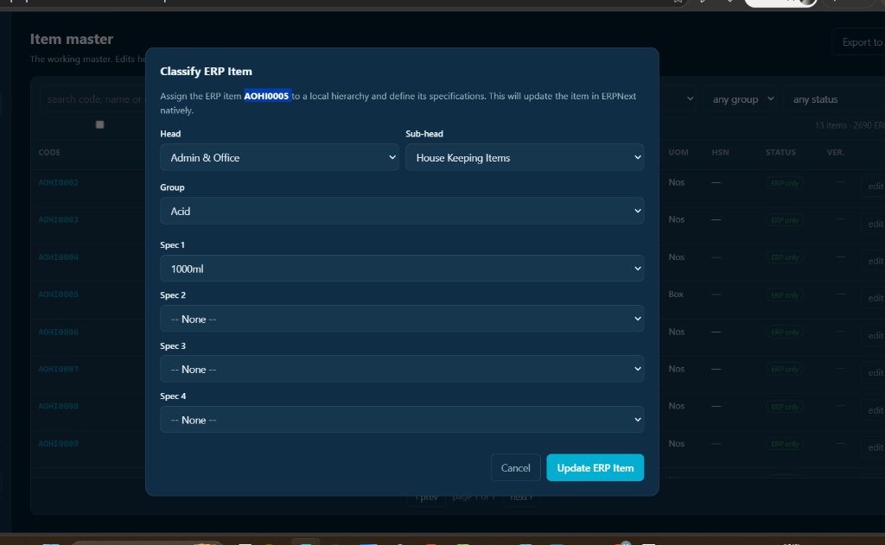

<div align="center">

# ✨ Item Code Studio

### The Intelligent Item Code Generator & ERPNext Bridge

[](https://python.org)
[](https://sqlite.org)
[](https://erpnext.com)
[](LICENSE)

*A beautiful, AI-powered web application that generates mathematically structured 15-digit item codes, manages a living item master, and synchronizes everything with ERPNext — built for Minimines Cleantech Pvt. Ltd.*

---



</div>

---

## 🎯 What Does It Do?

Item Code Studio is the **single source of truth** for your entire item taxonomy. It enforces a strict hierarchical code grammar while providing an intuitive, premium UI for:

| Feature | Description |
|---------|-------------|
| 🏭 **Code Generation** | Mint structured 15-digit codes from a `Head > Sub-head > Group > Specs > Vendor` hierarchy |
| 🤖 **AI Invoice Parsing** | Upload purchase invoices (PDF/Image) → OCR extracts items → AI auto-classifies them |
| 📋 **Item Master** | Central repository of all items with version control, diffs, and audit trails |
| 📖 **Dictionary** | Manage Heads, Sub-heads, Groups, spec slots, and their relationships |
| 🔗 **ERPNext Bridge** | Two-way sync with ERPNext — push codes, pull taxonomy, classify ERP-only items |
| 🔍 **Decoder** | Reverse-engineer any code to see exactly what it represents |
| 📊 **Activity Log** | Full audit trail with visual diffs for every change |

---

## 🧬 The Code Grammar

Every item code is a **15-character alphanumeric string**, mathematically structured:

```
R M B S 0 0 1 0 2 0 2 0 1 0 0
├─┤ ├─┤ ├───┤ ├─┤ ├─┤ ├─┤ ├─┤
HEAD SUB  GRP  S1  S2  S3  VND
```

| Segment | Length | Example | Meaning |
|---------|:------:|---------|---------|
| **Head** | 2 chars | `RM` | Raw Materials |
| **Sub-head** | 2 chars | `BS` | Battery Scrap |
| **Group** | 3 digits | `001` | Cobalt Hydroxide |
| **Spec 1–4** | 2 digits each | `02` | NMC Chemistry |
| **Vendor** | 2 digits | `00` | Generic / No vendor |

---

## 📸 Screenshots

<div align="center">

### Create Codes — AI-Powered Classification

<p><em>The editing form with Head, Sub-head, Group, and Spec dropdowns. The color-coded item code builds live at the bottom.</em></p>

---

### Invoice OCR — Automatic Line Extraction

<p><em>Upload any purchase invoice PDF — the OCR engine extracts item descriptions, quantities, and HSN codes automatically.</em></p>

---

### Item Master — Central Repository

<p><em>The working master showing confirmed items, ERPNext-synced items, and ERP-only items with Push to ERP capabilities.</em></p>

---

### Dictionary — Taxonomy Manager

<p><em>Group detail view showing spec slots, values, and action buttons (Rename, Move, Merge, Retire).</em></p>

---

### Classify ERP Items

<p><em>Assign structured metadata to ERP-only items without changing their original code.</em></p>

</div>

---

## 🚀 Quick Start

### Prerequisites
- Python 3.10+
- Google Chrome or Edge (recommended)

### 1. Installation

```bash
git clone https://github.com/codeunderscrap/itemcode.git
cd itemcode
pip install -r requirements.txt
```

### 2. Launch

```bash
python server.py
```

- **Local:** `http://localhost:8756`
- **Network:** `http://<your-ip>:8756`

### 3. Account Setup

```bash
# Create admin user
python manage.py adduser admin --name "System Admin" --admin

# List users
python manage.py listusers

# Reset password
python manage.py resetpw admin
```

> **Note:** On first launch with a fresh database, an `admin` account is auto-created and the temporary password is printed to the terminal.

---

## 🏗️ Architecture

### Tech Stack

| Layer | Technology |
|-------|-----------|
| **Backend** | Pure Python 3 (stdlib + `rapidfuzz` + `paddleocr` + `pymupdf`) |
| **Frontend** | Vanilla JS (`app.js`, `create.js`, `master.js`) + Pure CSS |
| **Database** | SQLite in WAL mode — concurrent reads/writes without a DB server |
| **ERP Integration** | ERPNext REST API via `core/erp.py` |
| **OCR Engine** | PaddleOCR for invoice text extraction |
| **AI Classifier** | LLM-powered item classification pipeline |

### Key Modules

```
├── core/
│   ├── db.py          # Database helpers (rows, one, log, settings)
│   ├── erp.py         # ERPNext REST API client
│   ├── matcher.py     # Fuzzy matching & AI classification
│   └── codes.py       # Code minting & collision avoidance
├── routes/
│   ├── create.py      # Code generation API & cascade logic
│   ├── master.py      # Item master CRUD, ERP sync, taxonomy
│   └── auth.py        # Session management & user auth
├── web/
│   ├── index.html     # Main SPA shell
│   ├── app.js         # Dictionary, decoder, navigation
│   ├── create.js      # Code creation UI & invoice upload
│   ├── master.js      # Item master grid & ERP classification modal
│   ├── style.css      # Premium dark theme
│   └── settings.js    # Configuration panel
└── docs/
    ├── Item Code Studio — User Handbook.pdf
    ├── ItemCode_Generator_Handbook.html
    └── handbook_images/
```

### Smart Group Management

Because item codes are **permanently issued**, the system follows a **Freeze-on-First-Use** rule:
- Groups can be **Retired** (safely parked) but never truly deleted
- Retired sequence numbers are never reused
- Moving a group recalculates codes without breaking active ERPNext items

---

## 🔗 ERPNext Integration

| Feature | Direction | Description |
|---------|:---------:|-------------|
| **Push Items** | `→ ERP` | Push newly minted codes with full metadata to ERPNext |
| **Pull Items** | `← ERP` | Fetch ERP-only items into the local master |
| **Classify** | `↔ ERP` | Assign Head/Sub-head/Group/Specs to ERP-only items |
| **Sync Taxonomy** | `← ERP` | Import missing Item Groups from ERPNext into local Dictionary |
| **Spec Registration** | `→ ERP` | Auto-register Item Specifications in ERPNext |

Configure via **Settings** → ERPNext URL, API Key & Secret.

---

## 📖 Documentation

| Document | Format | Description |
|----------|--------|-------------|
| [User Handbook (PDF)](docs/Item%20Code%20Studio%20—%20User%20Handbook.pdf) | PDF | Complete step-by-step guide with screenshots |
| [User Handbook (HTML)](docs/ItemCode_Generator_Handbook.html) | HTML | Interactive version — open in browser |

---

## ☁️ Deployment

The application can be deployed to any Ubuntu/Debian VPS:

```bash
# Using Docker (recommended)
docker build -t itemcode .
docker run -p 8756:8756 -v ./data:/app/data itemcode

# Using systemd + Caddy (for auto HTTPS)
# See install/vps/ for deployment scripts
```

---

## 📦 Backups

```bash
# Run backup
python install/backup.py run

# Export master to Excel
# Use the "Export to Excel" button in the Item Master UI
```

---

<div align="center">

### Built with ❤️ for Minimines Cleantech Pvt. Ltd.

*Item Code Studio v2.0 — August 2026*

</div>
